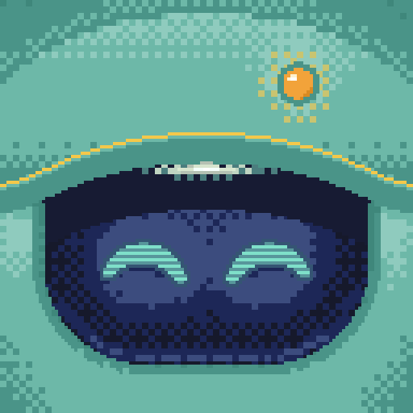
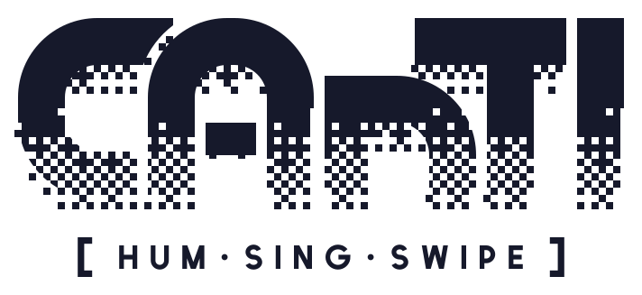

<p align="center">
  
</p>

<p align="center">
  <picture>
    <source media="(prefers-color-scheme: dark)" srcset="brand/canti-wordmark-stipple-light.svg">
    
  </picture>
</p>

<p align="center"><b>Hum at your phone. It listens.</b><br>
A hands-free Android controller driven by non-speech vocal sounds: hums that rise and fall, tongue clicks, hisses, whistles.</p>

<p align="center">
  
  
  
  
  
  
  <br>
  
  
  
  
  
  
  
</p>

---

## What it is

Canti turns sounds into phone actions. You hum a rising note and it swipes up. Two tongue clicks take you home. A hiss goes back. No words needed, no hands needed. (・ω・)

- **Canti** is the app (and the name on the icon).
- **VOX** is the project and the repo underneath it.

The sound comes from one of two places:

| Source | What hears you | Status |
|---|---|---|
| **Phone mic** | the phone itself, through the same extractor compiled to native code | works today |
| **Pico** | a necklace: a Raspberry Pi Pico 2 W and an INMP441 mic, sending one text line per sound over Bluetooth LE | firmware works; the current build's mic wiring is being fixed |

## How it works

```
 sound
   │
   ▼
┌──────────────┐   one text line per sound:
│  extractor   │   "hum that rises from low to high; pitch change large; duration short; …"
│ (Pico or     │   + a small fingerprint
│  phone, C++) │
└──────┬───────┘
       ▼
┌──────────────┐   level gate (fans, keyboards), media lock, touch guard
│    guards    │   → drop what isn't you
└──────┬───────┘
       ▼
┌──────────────┐   your calibration + trained gestures
│ personalize  │   → relabel a sound the extractor got wrong for your voice
└──────┬───────┘
       ▼
┌──────────────┐   groups sounds by device time (short gaps join)
│  sequencer   │   → "click click" is one gesture, not two
└──────┬───────┘
       ▼
┌──────────────┐   rules first (fast, exact)
│   decider    │   ├─ model: a local student over /v1/systemone
│              │   └─ cloud: hard cases only (off by default)
└──────┬───────┘
       ▼
┌──────────────┐   AccessibilityService: swipe, tap, back, home…
│   executor   │   then checks the screen actually changed
└──────────────┘
```

Every stage is its own file in `android/app/src/main/java/ai/vox/companion/`. Its message format is in [`android/PROTOCOL.md`](android/PROTOCOL.md).

## The gestures

| You make | Canti does |
|---|---|
| hum rising / falling | swipe up / down |
| hum arching / dipping | swipe right / left |
| rise or fall, then hold the note | keep scrolling while you hold |
| hiss (or hiss click) | back |
| click click | home |
| click hiss | forward |
| flat hum | long press |
| pop | tap (Pico; on the phone mic a lone pop does nothing unless you bind it) |
| pop pop | listen for a spoken phrase |

A few extras sit on top:
- **Voice cursor:** your pitch steers a pointer across the screen.
- **Spoken phrases:** "open camera" or "tap send", for example. They start after the listen gesture.
- **Your own sounds:** enroll a custom sound and bind it to any action.

## The models

Rules decide every gesture above. Models only come in where rules can't: phrases that don't match exactly, and picking the right thing to tap on a screen.

| Model | Job | Where it runs |
|---|---|---|
| **Verdict** (multilingual-e5-small bi-encoder, 118M) | picks the on-screen target for a phrase, or says "not here" | nowhere yet: training on real screens; the planned phone model (int8 ONNX, 118 MB) |
| **jevlike** (e5 encoder) | sound line + screen → action, in Jev's typed-choice format | the PC, through `finetune/servers/systemone.py` |
| **Cloud** (DeepSeek on Ollama) | hard cases only | ollama.com, only when escalate mode is on |

All three use one wire format: a text `state`, named options, and typed answers with probabilities.

## Repo map

```
VOX/
├── android/      the Canti app (Kotlin) + emulator test suite + nix flake
├── ui/           Flutter screens, built into the app; ui/desktop previews them on Linux
├── extractor/    reference sound extractor (Python): the spec and test oracle
├── firmware/     Pico 2 W firmware + the C++ extractor port (checked bit-exact against Python)
├── finetune/     data generators, students (jevlike, Verdict), training sweeps, local server
├── hardware/     3D-printed necklace case (OpenSCAD) + protoboard template
├── brand/        icon, wordmark, palette, pixel-art tools
├── wiki/         architecture, decisions, process, training: the why behind everything
├── reports/      finished research reports
└── research_notes/
```

Each folder has its own README. For the reasoning behind any choice, start at [`wiki/index.md`](wiki/index.md).

## Build

Every workspace brings its own environment, so there's nothing to install globally.

| Part | Command (from that folder) |
|---|---|
| App + unit tests | `android/suite/run.sh build` |
| Emulator suite | `android/suite/run.sh boot && android/suite/run.sh setup && android/suite/run.sh test` |
| Flutter UI tests | `cd ui && flutter test` (inside the Android dev shell) |
| Extractor tests | `extractor/run python -m pytest tests -q` |
| Firmware | `firmware/tools/build.sh` (add `--upload` to flash over the Pico's own serial port) |
| Firmware parity | `firmware/tools/check_extract.sh` (the C++ extractor vs Python, event for event) |

Notes:
- The dev box is NixOS on an AMD Strix Halo (gfx1151) with ROCm.
- Training uses `finetune/env.sh` and the ROCm torch in `finetune/.venv`. Don't replace that torch.

## Not in git

Code and docs only. These stay on disk:
- public audio datasets (~45 GB, fetch steps in [`datasets/README.md`](datasets/README.md));
- model checkpoints, generated training data, predictions and logs;
- emulator state and APKs;
- **your voice recordings, phone screens and event logs.** These are private and never leave the machine.

## Status

It works end to end on a Galaxy Z Flip with the phone mic. Right now:
- The Pico's mic needs its wiring checked.
- The newest build fails some emulator tests, and those are being fixed.
- Verdict isn't on the phone yet.

The live list is in [`wiki/roadmap.md`](wiki/roadmap.md). ( ˘▽˘)っ

## Licence

[MIT](LICENSE) © 2026 dxcently. The Canti icon is an original robot head inspired by Canti; it's not a likeness.
