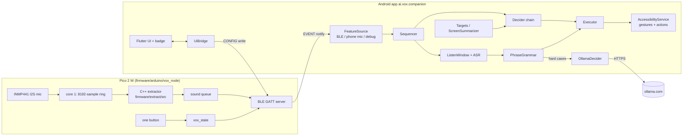

# Architecture (as built, 2026-09-27)

Canti (the project is called VOX) turns non-speech mouth sounds into phone actions: hums that rise or fall, whistles,
pops, clicks and hisses. The main path is:

1. A Raspberry Pi Pico 2 W with an INMP441 mic, worn as a pendant, hears the sound.
2. The Pico describes each sound as one line of text.
3. It sends that line to an Android app over Bluetooth LE.
4. The app decides what the sound means and performs the swipe, tap or navigation.

This page describes the system as it is in the code now. For why it is built this way, see
[decisions.md](decisions.md). The original research-era plan (DTW, HID, Jev in the cloud) is on [index.md](index.md);
parts of it were changed.

## End-to-end data flow

Phone-only mode skips the Pico. `audio/MicCapture` reads the phone's own mic (or a USB mic). It runs the same C++
extractor through JNI (`libvx_jni.so`) and feeds the same `FeatureSource` interface.

## Pico firmware

The sketch is in `firmware/arduino/vox_node/`, built with arduino-pico. See `firmware/README.md` and
`firmware/HARDWARE.md`.

| Module | Job |
|---|---|
| `vox_node.ino` | Setup and main loop; 8 s watchdog |
| `config.h` | `VOX_FW_VERSION "0.2.2"`, pins, options such as `VOX_SLEEP_STAYS_AWAKE` (for power banks) |
| `mic.*` | INMP441 over I2S (PIO) |
| `ext.*` | Runs the extractor on core 1 from an 8192-sample (512 ms) ring, with a 4-entry sound queue |
| `out.*` | Builds the feature and hold JSON messages |
| `ble_link.*`, `btstack_sm_lesc.c` | GATT server, LESC Just Works bonding, fragmenting |
| `vox_state.*` | Mode, armed and sleeping state; the state JSON (including `by:"button"`) |
| `controls.*` | The one button |
| `status_led.*` | The single blue LED: pairing and connection only |
| `power.*` | Light sleep and wake. Wake starts the mic before the radio, which fixes a CYW43/PIO clash (checked over 10 sleep/wake cycles). |
| `test_player.*`, `test_sounds.h` | Canned test sounds. Hold the button while plugging in to start them. |
| `console.*` | USB serial console, including `ext feed` for test vectors |

**Extractor.** `firmware/extract/src` is a module-by-module C++ port of the Python reference `extractor/vox_extract`
(design in `extractor/README.md`):
- the front end runs at 16 kHz, with a 10 ms hop and a 32 ms window;
- pitch is found with MPM;
- the noise floor uses minimum statistics;
- sounds are labelled rise, fall, arch, dip, flat, pop, click, hiss or unknown.

Measured on the Pico:
- one hop averages about 238k cycles (16% of the budget), with a maximum of 279k;
- core-1 load is 15.6%;
- all 19 test vectors pass.

Both firmware and phone check the vocabulary digest `139d86bd72e13ae5`.

**Holds.** A sound held longer than 300 ms sends `hold: start` and later `hold: end`. This makes held scrolling work.
Glide-and-hold (`from: "glide"`, `dir`) lets a rise or fall that settles on a steady note keep scrolling. It has two
guards:
- `hold_glide_quiet_ms` 700 and `hold_glide_delay_ms` 300;
- a 1.5-semitone end-pitch rule.

On the live recordings the guards cut false glide-holds from 220 to 11. **The user flashed 0.2.2 at about 05:34 UTC on 09-27** (01:34 local). The console `status` reports "vox_node
0.2.2", so the board runs glide-hold with both guards and the button tag. It was re-paired afterwards through the
console's `btn hold 5500`.

**Size (0.2.x builds).** About 514–519 KB of flash (the glide build is 519,020 B) and 269,992 B of RAM.

### Button

This is the one-button scheme from [D048](decisions.md#d048) (`controls.cpp`, `android/PROTOCOL.md`). Presses in a
series are up to 400 ms apart, with 25 ms debounce.

| Press | Awake | Asleep |
|---|---|---|
| 5 presses | Toggle armed / off | Wake, then arm once a phone subscribes |
| 1 click | Toggle mode (gesture ⇄ cursor), sent with `by:"button"` | nothing |
| Hold 1 s | Disarm; sleep on release | nothing |
| Hold 5 s | Open a 60 s pairing window | Wake plus pairing window |

Light sleep draws an estimated 15–25 mA (unverified on hardware). The pendant runs from an external USB power bank.

## BLE protocol (GATT v1)

The full reference is `android/PROTOCOL.md`.

| Characteristic | UUID | Use |
|---|---|---|
| Service | `ac740001-3c66-cc47-6290-e0e7094c17b9` | |
| EVENT | `ac740002-…` | notify: feature messages, hold messages, state |
| CONFIG | `ac740003-…` | write: app commands (arm, mode, sleep, …) |
| INFO | `ac740004-…` | read: version and capabilities |

- **Fragments.** Each fragment starts with a header byte: bit 7 marks the last fragment, bit 6 the first, and bits
  0–5 hold a counter. A message can be up to 4096 B; the MTU is 517.
- **Pairing.** LESC Just Works bonding. New bonds are accepted only inside the 60 s pairing window.
- **State.** A state message is sent when notifications are enabled. Every CONFIG write gets exactly one reply, with
  `rejected: <reason>` on refusal. The app times out after 1.5 s.
- **Sleep and disconnect.** The device sends `sleeping` before it sleeps. A disconnect disarms, and there is no
  automatic re-arm ([D048](decisions.md#d048)).
- **Tap to wake.** A pause caused by a dropped link is `wakeable`. The badge then shows its TAP face. Tapping it sends
  `armed: true` plus the user's last chosen mode (`canti_device/user_mode`).

Feature message: `{v, id, mode, armed, sounds[], sequence[], timing[], phrase, features[], cursor}`. The `sounds`
lines are the exact phrasings from `finetune/vox/schema.py`, generated into `Vocab.kt` by `tools/gen_vocab.py`.

## Android app (`android/app`, package `ai.vox.companion`)

This is an AccessibilityService with a foreground listening service. The source table is in `android/app/README.md`.
The app has 386 JVM tests (the latest run, by the grammar fork).

### Pipeline

| Stage | Files | What it does |
|---|---|---|
| Sources | `FeatureSource`, `BleFeatureSource`, `BleLink` (Reassembler, LinkRecovery), `DeviceLink`, `audio/PhoneMicSource`, `audio/MicListenService` | Deliver feature messages from the Pico, the phone mic or the debug socket |
| Sequencing | `Sequencer` | Groups sounds on the **device clock** (gap ≤ `gap_ms` 600, plus `jitter_ms` 150). It waits only when a longer bound sequence could follow ([D028](decisions.md#d028)). |
| Personalisation | `Personal` | Matches the user's enrolled sound fingerprints ([personalization.md](personalization.md)) |
| Decision | `Decider` (`RuleDecider`), `HttpDecider` (`SystemOneClient`, `ChainDecider`: rules \| model \| hybrid), `OllamaDecider` (`escalate`, `EscalatingDecider`, `Risk`) | Rules first. A model server is optional. The cloud handles hard cases. |
| Screen | `TreeReader`, `ScreenSummarizer`, `StateBuilder`, `Targets`, `OptionFormat`, `RootCheck` (refuses a stale tree), `ForegroundApp` | Describe the screen, and list tappable targets for intent cursor mode |
| Actions | `Executor`, `Navigation` (`SwipeGeometry`), `Swipes`, `ScrollStep`, `AutoScroll`, `Volume`, `TimerTarget`, `AppChoice` | Perform the gestures and actions |
| Guards | `Confirmer`, `Outward` (confirm pop for likes, follows and shares, `outward_confirm_ms` 3000), `MicPopGate` (phone and USB mic pops do nothing), `SystemDialog` | Safety |
| Phrases | `ListenWindow` (`listen_window_ms` 6000), `AndroidPhraseRecognizer`, `PhraseGrammar`, `TargetQuery` (filler normaliser), `VoiceTyping`, `AudioFileAsr` | Speech after `pop pop` |
| UI glue | `Overlay`, `Badge`, `CantiBadgeView`, `UiBridge`, `MainActivity`, `LegacySettingsActivity`, `Settings` (KeystoreSecrets, AES-GCM), `EventLog`, `LauncherIcon`, `Pairing`, `UserMode`, `audio/CantiNotification` | The badge, notification, settings and log |
| Generated | `Vocab.kt`, `TargetVocab.kt` | From `finetune/vox/schema.py` via `tools/gen_vocab.py` |

### Default bindings (`Vocab.kt`)

| Sound(s) | Action |
|---|---|
| rise / fall | swipe up / swipe down |
| arch / dip | swipe right / swipe left |
| rise or fall, then a held hum (or glide-and-hold) | continuous scroll while the note is held |
| hiss | back (acts at once) |
| hiss click | back (the click is absorbed) |
| click click | home |
| click hiss | forward (app only) |
| flat | long press |
| pop | tap, Pico only. Phone and USB mic pops do nothing ([D135](decisions.md#d135)). In cursor mode a pop clicks from every source. |
| pop pop | listen for a phrase (since 09-27; [D130](decisions.md#d130)) |

`DEFAULTS_TEXT` in `Vocab.kt` still says `click pop=listen`. It has to match, byte for byte, the text the models were
trained on, so it was left alone on purpose.

**Swipe geometry.**
- `Navigation.kt` `SwipeGeometry`: a vertical swipe runs from 72% to 12% of the screen in 100 ms; horizontal runs from
  85% to 15%, also in 100 ms. `PROTOCOL.md` and `app/README.md` match this (fixed 2026-09-27).
- Ordinary lists get a no-momentum step (`ScrollStep.kt`): a 300 ms stroke held for 150 ms, with step sizes small 0.25,
  medium 0.5 and large 0.75.

### Phrases, ASR and voice typing

- `pop pop` opens a `listen_window_ms` (6000 ms) window. Android's on-device `SpeechRecognizer` transcribes the speech
  (`asr_allow_online` is false).
- **Grammar.** `PhraseGrammar` handles deterministic commands:
  - timer and volume (context-aware; amounts, exact levels, mute; [D113](decisions.md#d113));
  - swipe, next and previous, with repeats capped at 5;
  - like (with a confirm), home, back and other navigation;
  - open app (`app_prefer` maps youtube → RVX);
  - tap on a target;
  - `type …` and dictation.
- **Lone words.** A lone "up" or "down" scrolls only with the Pico ([D123](decisions.md#d123)).
- **Dictation** stops on any of:
  - 4 s of silence;
  - a Pico sound at least `dictate_speech_hold_ms` (1000) after the last words;
  - "stop dictation";
  - 2 minutes.
- **Typing** uses `ACTION_SET_TEXT` and `SET_SELECTION`, not paste. `log_typed_text` is off by default.

### Intent cursor and target picking

- **Options.** `Targets` lists the on-screen elements as options of the form `label (role, position)`, with the
  position in 3×3 cells. There are at most 39 options plus "none".
- **Picking.** A phrase such as "tap the search button" is matched to one option. A pick needs confidence ≥
  `target_min_confidence` (0.6). The top 3 are highlighted.
- **Who picks today.** On the phone, picking uses the grammar and fuzzy matching, and the cloud decider when escalated.
  **Verdict is not on the phone yet** (see below).
- **New option text.** A new option format adds row context and ordinals such as "2nd of 5 down". It is held behind
  `option_format` until Verdict is retrained on it ([D116](decisions.md#d116)).

### Cloud decider

`OllamaDecider` calls the Ollama `/api/chat` endpoint at `https://ollama.com`:
- the model is `deepseek-v4.1-flash`, with a deadline of `ollama_timeout_ms` 1500 (targets: 2500);
- the key is stored with Keystore encryption and set from `~/.config/vox/ollama_key`;
- it sends `User-Agent: Canti/<version> (Android)`, because ollama.com returns 403 to the Dalvik agent.

Only hard cases are sent ([D072](decisions.md#d072)). Cloud answers are unscored, so risky actions need a confirm pop.

### Badge, notification and modes

- **Badge.** The floating badge is an animated pixel Canti drawn from `ui/assets/badge/canti_badge.{png,json}` (see
  [design-process.md](design-process.md#badge)). Its face shows the state, and it shows a "shrug" face when a sound is
  ignored.
- **Notification.** "Canti is listening" is always on. It has Cursor ⇄ Gesture, Pause/Resume and Source buttons.
- **Mode.** The device owns the mode, and the app follows the `mode` flag. Tap-to-wake restores the mode the user last
  chose from the badge, the notification or the button.

## Flutter UI (`ui/`)

- **Module.** `vox_ui` is an add-to-app Flutter module ([D040](decisions.md#d040)).
- **Backends.** Screens talk to a `VoxBackend` interface. `ChannelBackend` connects to the Android app; `FakeBackend`
  drives the desktop preview.
- **Files.** `lib/src/status_screen.dart`, `pair_screen.dart`, `canti_head.dart`, `app.dart`.
- **Theme** (`lib/src/theme`): the 1-bit pixel kit, the `dither_field.frag` shader (FLCL-style dither), `clearing.dart`
  (a clear area so text stays readable) and `sprite.dart`.
- **Desktop.** `ui/desktop` runs the same screens on Linux.
- **Tests.** `flutter test`: 42/42 in `ui/`.

## Models and how they are served

| Model | What it is | Where it runs now |
|---|---|---|
| Rule decider | Bindings in `Vocab.kt` plus profiles | On the phone (always) |
| jevlike | Local "Jev-like" decision model (e5 encoder, `finetune/students/jevlike`) | `finetune/servers/systemone.py` on the PC, port 8765 (`/v1/systemone`); also serves `decider-4b` and `jevk5` |
| Verdict | Bi-encoder target picker, multilingual-e5-small (118M), fine-tuned from the upstream Verdict weights (`finetune/students/verdict`, upstream in `third_party/verdict`) | **Not served anywhere yet.** The best run is `verdict-bi-real-v1d`; int8 ONNX exists (118 MB; a pruned version is 45 MB). The app has no ONNX runtime. `systemone.py` reports `option_format` via `VOX_VERDICT_RUN` in `/health`. |
| Cloud | DeepSeek V4.1 Flash on Ollama cloud | Called straight from the phone for hard cases |
| Teachers | JevK5, Decider 4B | PC only, for labelling ([training.md](training.md)) |

Kev 0.8B was dropped ([D061](decisions.md#d061)).

## Test setup

**Emulator suite** (`android/suite`, entry point `run.sh`):
- a headless API 35 AVD (`vox35`) with pinned F-Droid stand-in apps (`apks.lock.json`) and a fixture app;
- 34 emulator tests driven through the app's debug socket `vox-debug` (via `adb forward` to tcp:7788);
- a fake `/v1/systemone` on port 8767, and the real server on 8765;
- harvesters (`harvest*.py`) that capture screens and option lists for training.

The suite is described in `android/suite/README.md`.

**Z Flip tests** (the user's own phone, a Samsung Z Flip):
- The rules are in [process.md](process.md#phone-driving-rules).
- Rounds 1–4 of the social-app gesture test ran on 09-27. The write-up is private:
  `android/suite/out/zflip/social_gesture_test.md`.

### Latency

These were measured on the Z Flip with screenrecord and canned Pico sounds (aa60915, 09-27). Figures are median / p90
in ms.

| Feed | Sound end → screen settled | Execution → first movement |
|---|---|---|
| TikTok | 310 / 351 | 46 |
| Reels | 480 / 880 | 122 |
| Shorts | 490 / 507 | 93 |

BLE receive to execution took 14–25 ms. The earlier 505 ms figure (round 3) was an artefact of polling the
accessibility tree. Canned sounds skip the Pico's roughly 100 ms end-of-sound wait, so real hums are slower by about
that much. [latency-and-risks.md](latency-and-risks.md) has the research-era budget.

## Hardware

The case is `hardware/case/vox_case.scad`, with STLs in `hardware/case/out/`. It has:
- the INMP441 mounted in the lid, connected by a 5-wire Dupont cable to a right-angle header (column 9, rows 3–7);
- rubber bands and one top loop;
- a lid-in fit when worn ([D076](decisions.md#d076)).

The parts are base, lid, plunger, mic_clip, fit_test and mic_test.

**Build status (09-27):** the pendant isn't built yet. No mic, button or LED is wired, and the INMP441 hasn't been
bought, so `status` showing "mic: none" is expected. Everything above was measured on the bare Pico (console, test
vectors, canned test sounds). The wiring is in `firmware/HARDWARE.md`. A LEGO-style
build book is in progress ([design-process.md](design-process.md#lego-build-book)).

## Known gaps between docs and code

- The phone still runs an older APK. Everything the grammar fork built (pop pop, the mic pop gate, typing, RVX) is not
  on it yet ([D140](decisions.md#d140)).
