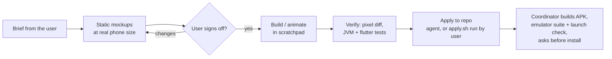

# Design process

This page covers how Canti's look was made: the app icon, the wordmark, the 1-bit pixel UI and the animated badge. It
also covers the path every visual change follows, and the LEGO-style build book. The brand files and colour tokens are
in `brand/README.md`. The decisions referred to are in [decisions.md](decisions.md).

## The flow: mockup → sign-off → animate → apply

1. **Mockups first.** Mockups are static images at the size they'll appear on the Z Flip, often several variants side
   by side (A/B/C). Nothing gets animated or wired in before the user approves. This became a standing rule after the
   user said on 09-27 at 00:33: "can we confirm design with me before reanimating?" ([D099](decisions.md#d099)).
2. **Parallel variants.** For open questions, the coordinator starts one agent per variant (for example icon mockups A1,
   A2, B1 and B2, [D054](decisions.md#d054)).
3. **Work in the scratchpad, then apply.** Agents draw in the session scratchpad and back up originals before touching
   the repo.
4. **apply.sh.** When the permission system blocked the badge agent's in-place edits (flagged as "irreversible local
   destruction"), the agent wrote `scratchpad/wake/anim/apply.sh` instead. The coordinator read it and explained it,
   and the user ran it by hand (09-27 03:57). The script:
   - checks that nothing changed since the backup;
   - regenerates the sheet;
   - verifies that the 63 old frames are pixel-identical and that exactly 2 new frames were added;
   - backs up each code file before its targeted edit.
5. **Build and install.** Only the coordinator builds the combined APK. Since 09-27 it runs the emulator suite and a
   launch check first ([D166](decisions.md#d166)), then asks before installing on the phone.

## App icon

- **First icon.** A sound-waves icon, then a peeking robot inspired by Canti (not a likeness; ab69ad3). Both are
  retired to `brand/old/`.
- **Four mockups** ([D054](decisions.md#d054)): A1 and A2 (head fills the tile), B1 and B2 (mostly screen). **B1 won.**
- **B1 iterations with the user** (09-26 18:38–19:54; a1df027):
  - B1c's hood;
  - B1d's cheeks;
  - B1h's eyes (later "Eve-like", tilted inward);
  - warped glass shine instead of bubbles;
  - trim at 67%, then 75%;
  - **B1x chosen as final** (19:46), then B1z2 body shading.
- **What was rejected:** Wall-E goggles, crying-looking eyes, and a star sparkle ([D059](decisions.md#d059)).
- **Lamp.** Warm orange `#F2A33A` ([D060](decisions.md#d060)); a blue lamp variant was rejected.
- **States.** On (eyes lit, lamp glowing) and off (eyes dark, lamp unlit). The launcher switches with an activity-alias
  when the connection state changes.
- **Stipple version** (a42082a, `brand/tools/stipple.py`): every edge, line and highlight is on a 4-unit grid, shading
  is ordered-dither dots, and the eyes are pixel scanlines. The launcher and in-app icon use it.
- **v5 and v5b (09-27, a9363e6).** After round 5 the user saw the old icon on the phone and asked for the gold trim
  ("the yellow line") to run to the border ([D156](decisions.md#d156), [D157](decisions.md#d157)). v5 did that and
  took the hood to full bleed. The user then asked for the hood's shaded top to be pixelated ([D162](decisions.md#d162)):
  **v5b** uses whole-dot steps on the dome and a Bayer-dithered crown. Approved and applied at 11:18
  ([D164](decisions.md#d164)). In the launcher's adaptive layers the hood, crown dither, trim and body now continue across
  the full 108 dp layer, so no box edge shows under any mask or parallax (`brand/README.md`). The coordinator then
  restarted the phone's launcher so the new icon showed ([D159](decisions.md#d159)), and "the APK has the new icon" became
  a build check ([D160](decisions.md#d160)).

## Wordmark

- **Requirements.** B/W primary, all paths (no fonts), letters that interlock "like FLCL" without copying it, and the
  subtitle `[ HUM · SING · SWIPE ]` ([D055](decisions.md#d055)). Agent a8b23f1.
- **Colour version.** Soft shine brighter toward the centre, no shine on the A ([D060](decisions.md#d060)).
- **Stipple wordmark.** Solid tops that fall off into a dot grid. The user asked for less black bleed, and **v5** was
  approved ([D086](decisions.md#d086)).

## Palette

| Token | Hex |
|---|---|
| teal | `#6DB8A8` |
| teal-shade | `#4A9488` |
| mint-cream | `#DDEBD3` |
| visor-navy | `#1D2757` |
| screen-glow | `#7FE0C9` |
| slate | `#3C4C7E` |
| orange (lamp) | `#F2A33A` |
| yellow | `#F6C945` |
| red | `#D6453D` |
| ink | `#16192B` |

## App UI style

1. **Cartoon edged** ([D056](decisions.md#d056)). The result read as "neobrutalist" and was rejected
   ([D078](decisions.md#d078)).
2. **Redesign around the user's reference image.** A 1-bit RPG-style pixel kit with 2-tone brand colours plus signal
   colours, **keeping the FLCL dither** ("one of the main design elements", [D079](decisions.md#d079)).
3. **Implementation** (a42082a, `ui/lib/src/theme`):
   - `dither_field.frag`, the shader for the dither background;
   - `clearing.dart`, a clear area behind text so it stays readable ([D095](decisions.md#d095));
   - `sprite.dart`, the badge player on the Flutter side.

## Badge

The floating badge is a small animated pixel Canti. Its face shows the state: listening, heard, the action, paused,
off, error, shrug, or tap-to-wake.

| Step | Decision |
|---|---|
| Concept | Animated head for the badge; the notification and the badge both switch modes ([D088](decisions.md#d088)) |
| Look | Head + tiny body, pixel art with dither shading ([D090](decisions.md#d090)) |
| Method | An SVG rig rendered into stipple frames by `brand/tools/canti_sprite.py`; chibi, head about 55% of the height ([D093](decisions.md#d093)); an antenna added |
| Size | Chunky 4 px pixels, 85 dp ([D096](decisions.md#d096)), then smaller: the chibi **v3A** ([D099](decisions.md#d099), [D101](decisions.md#d101)) |
| Shoulders | Static mockups A/B/C; **C** chosen ([D111](decisions.md#d111)) |
| Ignored sound | A distinct shrug face ([D097](decisions.md#d097)) |
| Tap-to-wake | Mockups A/B/C; **C, the face says TAP** ([D122](decisions.md#d122)), applied with `apply.sh` |

**Debug op.** `badge_hide {hide, ms}` (09-27) hides the badge for `ms` and then restores it; the harvest uses it so the
badge doesn't cover buttons in screenshots ([D165](decisions.md#d165)).

**Sheet.** `ui/assets/badge/canti_badge.{png,json}`: 65 frames of 34×47 px, 272×423 in total, the same file for the
Android app and Flutter. The Kotlin side is `CantiBadgeView.kt` and `Badge.kt`.

## Joystick indicators (09-27)

The voice joystick needed to show pitch and steering. The user asked (08:00) whether a
sprite on the badge's face ("the TV") or a separate popup would be better ([D152](decisions.md#d152)).

- **Mockups** (a46729b, static, at 1:1 and ×4, on light and dark backgrounds; drawn with the badge rig's own face
  convention):
  - cursor A, an arrow whose length shows speed; cursor B, a ring with 1–3 chevrons ahead of it;
  - face A, a bar growing up or down from a lit middle line (4 steps each way, `[----]` in the dead zone, an arrowhead
    past the range, a side pointer for ee / oo, dashed when not voiced); face B, a dot on a crosshair (2 steps).
  - The agent recommended A + A.
- **Chosen:** cursor B (chevrons) and face A (bar), no popup. Recorded in the brand memory; the user's own words are not
  in the extracted log (unverified).
- **Built** first into the desktop prototype (a60c8f5, 08:31), then on Android in `joystick/JoyIndicators.kt`
  (a64985c).
- **Flag from the mockups:** the cursor-pose badge crop is 30×46 art px (about 46×70 dp), not the 34×47 in the sheet
  caption.
- The voice-cursor setup screens and sliders were built with the existing UI kit, with no mockup round, by the user's
  choice ([D153](decisions.md#d153)).

## LEGO build book

The user asked on 09-27 at 04:48 for a step-by-step soldering and wiring guide "like a lego book instruction". The
choices were Part C (the necklace) only, as a web page ([D133](decisions.md#d133)).

- **Author:** fork a4236175, "Build book: draw all steps" (05:32 → 05:48 on 09-27), after the user approved the sample
  page's style ([D142](decisions.md#d142)).
- **Version 3 contents:** 28 steps starting from a bare Pico, because the user hadn't built the board yet
  ([D143](decisions.md#d143)). Steps 1–10 build and test it on a breadboard (headers, button, LED, mic, with console
  checks); steps 11–28 build the necklace. Nobody has reviewed the rendered layout since it was republished.
- **Where:** an HTML artifact (source `scratchpad/book/canti-build-book.html`), published at the artifact URL. It is
  **not in the repo**.
- **Hardware status:** nothing is wired yet (09-27 05:41: board not built, INMP441 not bought; 09-28: "still no mic").
- **Source material:** `firmware/HARDWARE.md` (wiring), `hardware/case/README.md` (printing and assembly) and
  [hardware.md](hardware.md).
