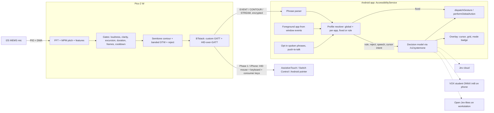

# VOX wiki: hands-free phone control by hum and pop

[Index](index.md) · [Hardware](hardware.md) · [Signal processing](signal-processing.md) · [Gestures and phrases](gesture-vocabulary.md) · [Decision models](decision-models.md) · [Personalization](personalization.md) · [Phone control](phone-control.md) · [App plan](app.md) · [Prior art](prior-art.md) · [Latency and risks](latency-and-risks.md) · [Roadmap](roadmap.md) · [Sources](sources.md)

As built: [Architecture](architecture.md) · [Training](training.md) · [Design process](design-process.md) · [Process](process.md) · [Decisions](decisions.md) · [Agent log](agent-log.md)

Full report: [../reports/VOX hum cursor with Jev.md](<../reports/VOX hum cursor with Jev.md>). Research notes: [../research_notes/VOX hum cursor with Jev/](<../research_notes/VOX hum cursor with Jev/>).

## Overview

VOX is a low-budget class project: a hands-free phone controller driven mainly by **non-speech vocal sounds** (hums with pitch contours, and mouth pops). **Spoken phrases are an opt-in add-on.** The design runs at two speeds:

- **Fast loop, about 10 ms (Pico 2 W).** 16 kHz I2S capture, MPM pitch tracking, feature bank, speech and noise gates, and banded-DTW template matching on semitone-relative contours.
- **Slow referee, about 250 ms or more (phone).** A text-in decision model reads categorical labels, the foreground app and plain-language profile rules. It can be Jev ([TypeSafe API](https://docs.typesafe.ai/api.md)), an open Jev-like, or a VOX-trained student.

Jev is measured at **252.8 ms median / 436.6 ms p95** ([HF Decision Index](https://huggingface.co/spaces/multimodalart/jev-decision-index/raw/main/data/index.json)). In the classic mouse study, a lag of 225 ms tripled errors ([MacKenzie & Ware 1993](https://www.yorku.ca/mack/CHI93b.html)). So the recommended default is **Design A (hybrid)**: fixed bindings act locally, and the model handles rule bindings, rejected sounds and spoken text. **Design B** (the model decides everything, including a toggled **Jev cursor mode**) is built and benchmarked against A. On iPhone VOX stays a BLE HID device, because iOS apps cannot inject touches ([Apple Developer Forums](https://developer.apple.com/forums/thread/129316)).

## Architecture

> **Note (librarian, 2026-09-27):** the diagram below is the original research plan from 2026-09-26. The built system
> differs in several places. There is no DTW on the Pico: a categorical extractor labels each sound. There is no HID and
> no Jev cloud. The cloud decider is DeepSeek via Ollama, and Verdict is the planned on-phone model. See
> [architecture.md](architecture.md) for the system as built.



ASCII fallback:

```
mic ─PIO/DMA─► Pico 2 W: FFT→MPM→features→gates→contour→DTW ─BLE GATT (encrypted)─► Android AccessibilityService
                                                         └─BLE HID (Phase 1, iPhone)─► OS pointer / switches
Android: foreground app + phrase parser + profiles ─fixed─► dispatchGesture / performGlobalAction
                                                   └rule/reject/speech/cursor─► /v1/systemone: Jev | VOX student | workstation Jev-likes
```

## Page map

| Page | What it covers |
|---|---|
| [Hardware](hardware.md) | Pico 2 W, microphone choice, BOM, the Pi/ESP32/$5-board questions |
| [Signal processing](signal-processing.md) | MPM pitch, feature bank, compute and RAM budget, toolchain traps, datasets |
| [Gestures and phrases](gesture-vocabulary.md) | Default gestures, speech gates, DTW re-recording, sound phrases, per-app profiles, arm/disarm |
| [Personalization](personalization.md) | Your own recordings on the phone: bindable custom sounds (any sound), ignore sounds, re-recorded gestures; the fp1 fingerprint |
| [Decision models](decision-models.md) | Jev claims vs evidence, request design, Design A vs B, Jev cursor mode, open Jev-likes table, audio-native gap, fine-tuning the VOX student on the workstation |
| [Phone control](phone-control.md) | BLE GATT link, Android AccessibilityService, overlay, opt-in spoken phrases, Phase 1 HID, iPhone limits vs Sound Actions |
| [App plan](app.md) | Full plan for the Android app: phone-mic listening, on-phone model, HUD and haptics, safety and stop paths, screens, testing, phases (draft) |
| [Voice cursor](voice-cursor.md) | Draft: absolute cursor where pitch sets height and the vowel sets sideways, per-person calibration with a snap-to-elements fallback; multi-voice check (speech, singers, hums), 5-minute go/no-go test |
| [Calibration vs gesture labels](calibration-gestures.md) | Desktop go / no-go: do the joystick setup's per-person numbers improve gesture labels as `vx_config` overrides? Not on current data (the GO list is empty); no labelled hums yet. Also the setup's retry-or-skip rule |
| [Phone mic echo](phone-mic-echo.md) | Go/no-go for a playback-reference echo canceller (AudioPlaybackCapture + AEC3) against media false triggers: acoustic run blocked (no speaker), simulated result NO-GO on gesture survival |
| [Prior art](prior-art.md) | Vocal Joystick, Sporka's hummed control, Mouse Grid, Talon, Parrot.py, Apple Sound Actions |
| [Latency and risks](latency-and-risks.md) | End-to-end latency budget per path, risk register |
| [Roadmap](roadmap.md) | Phases 0–5, benchmark protocol, A vs B shoot-out, fine-tune pipeline (being started in `~/VOX/finetune/`) |
| [Sources](sources.md) | All cited sources, grouped by page |
| [Architecture](architecture.md) | The system as built: firmware, BLE protocol, Android app, Flutter UI, models, test setup, data flow |
| [Training](training.md) | Datasets and versions, splits, the locked test and its seal, cross-fit, results, ship gates, privacy boundary |
| [Design process](design-process.md) | Icon, wordmark, 1-bit pixel UI, badge; mockup → sign-off → animate → apply; LEGO build book |
| [Process](process.md) | Coordinator, agents and forks; standing rules; blocked actions; crash recovery; sign-off steps |
| [Decisions](decisions.md) | Dated log of every decision (options, choice, reason, what it replaced), newest first |
| [Agent log](agent-log.md) | Every agent and fork: prompt, result, decisions, grouped by workstream |

## Key decisions

| Decision | Choice | Page |
|---|---|---|
| Input | Non-speech hums and pops at the core; spoken phrases opt-in and armed by a sound | [Gestures](gesture-vocabulary.md), [Phone control](phone-control.md) |
| Pitch reference | Relative to the start of each hum, never absolute ([Sporka et al. 2006](https://dcgi.fel.cvut.cz/wp-content/wpallimport-dist/publications/pdf/publications-2006-sporka-uais-acmp-paper.pdf)) | [Prior art](prior-art.md) |
| Board | Pico 2 W, $7, no WiFi used ([Raspberry Pi](https://www.raspberrypi.com/news/raspberry-pi-pico-2-w-on-sale-now/)) | [Hardware](hardware.md) |
| Mic | I2S MEMS through PIO+DMA; INMP441 to prototype, SPH0645 as fallback | [Hardware](hardware.md) |
| Pitch | FFT-based MPM with a clarity gate ([McLeod & Wyvill](https://www.cs.otago.ac.nz/graphics/Geoff/tartini/papers/A_Smarter_Way_to_Find_Pitch.pdf)) | [Signal processing](signal-processing.md) |
| Customisation | Sound phrases; global profile plus per-app overrides; fixed or plain-language rule bindings | [Gestures](gesture-vocabulary.md) |
| Link | Encrypted custom GATT service to an Android AccessibilityService | [Phone control](phone-control.md) |
| Phase 1 | BLE HID mouse + keyboard + consumer control on both OSes | [Phone control](phone-control.md) |
| iPhone | HID into AssistiveTouch / Switch Control, permanently | [Phone control](phone-control.md) |
| Jev role | Design A default; Design B and Jev cursor mode benchmarked against it | [Decision models](decision-models.md) |
| Jev input | Categorical labels computed on the device, with foreground app and rules ([Jev jaggedness](https://docs.typesafe.ai/model-jaggedness/jev-1.13.md)) | [Decision models](decision-models.md) |
| Own model | Fine-tuned VOX student trained on the workstation from code-labelled synthetic data. **Updated 2026-09-27:** Kev 0.8B was dropped. Verdict-118M (target picker) is the chosen phone model and is being retrained on real screens; it is not on the phone yet. jevlike is served on the PC behind `/v1/systemone` (retrained 2026-09-28 to parity with Verdict on real screens, [Training](training.md#jevlike-jl7jl9)), and hard cases go to a cloud model (DeepSeek via Ollama). See [Training](training.md) and [decisions D041/D061](decisions.md#d041) | [Decision models](decision-models.md), [Roadmap](roadmap.md) |

## Conclusion

The research changes the question from "can Jev drive a hum cursor?" to "where does a text-in decision model do something a microsecond tree cannot?" The answer is specific: reading plain-language per-app rules, mapping push-to-talk spoken text, judging sounds that match no template, and picking grid cells where latency is cheap. That same list defines the VOX student's training target. The field's largest gap is also VOX's biggest risk: nobody has published false triggers per hour for audible non-speech input on a phone ([Parrot.py PATTERNS.md](https://raw.githubusercontent.com/chaosparrot/parrot.py/master/docs/PATTERNS.md); [Mahmud et al. 2007](https://opendl.ifip-tc6.org/db/conf/interact/interact2007-2/MahmudSKS07.pdf)).

## Open questions / to verify on hardware

- **Decided:** a device button plus a switch jack does cursor mode and disarm; long flat hum = long-press; hiss = back, so taps don't wait. See [Gestures](gesture-vocabulary.md#default-gestures). **Updated 2026-09-27:** the device has one button and no switch jack ([D048](decisions.md#d048)), and `pop pop` now opens phrase listening ([D130](decisions.md#d130)).
- Can hums give **8 cursor directions**, or only 4?
- Measure **false triggers per minute** on negative audio. No published baseline exists.
- Measure **Jev p95 from the phone on LTE**. Only desktop and cloud figures exist.

- [Session log 2026-09-27](session-2026-09-27.md): handoff written before the PC was moved (local times, UTC−4); folded into [Decisions](decisions.md) and the [Agent log](agent-log.md) on 2026-09-28
- [Round 7 plan](round7-plan.md): agreed 2026-09-28; pop → clicks, the media-lock fix and its measurement, Live mode, feedback bubble, jevlike retrain
