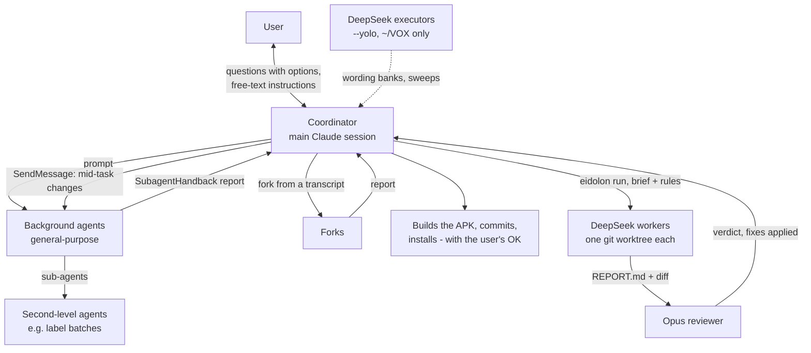

# How the work is run

VOX / Canti's first build took about 24 hours, from 2026-09-26 05:27 to 2026-09-27 05:30 UTC; rounds 5 and 6 followed
on 09-27, and round 7 planning and training on 09-28. One coordinator session worked with the user and ran up to about
a dozen background agents at a time. From 09-28 it also runs DeepSeek workers in git worktrees. This page covers how that works, the rules
everyone follows, and what happens when something is blocked or crashes. The agents are listed in
[agent-log.md](agent-log.md), and the decisions in [decisions.md](decisions.md).

## Roles

- **The coordinator** is the main session. It:
  - asks the user questions, usually multiple choice with a recommended option;
  - writes each agent's prompt, relays the user's decisions to running agents, and reads their reports;
  - builds the combined APK and commits to git.
- **Background agents** each own one area and one directory (for example "Work ONLY under ~/VOX/android"). Each prompt
  gives:
  - the context and the goal;
  - the files the agent may touch;
  - what is off-limits;
  - how to report.

  Agents run JVM, Python or Flutter tests, but they do not build or install the phone APK.
- **Forks** inherit the coordinator's context and get a directive. They were used to replace agents that died, and for
  new design work that needed the whole conversation (voice cursor, build book).
- **Second-level agents.** Two Verdict agents started 62 sub-agents for parallel labelling and checking (see
  [agent-log.md](agent-log.md#second-level-agents-verdict)).
- **DeepSeek V4.1 executors** were allowed `--yolo` inside `~/VOX` only, for wording banks and training sweeps
  ([D018](decisions.md#d018)).
- **DeepSeek workers through eidolon** (from 09-28): see [below](#eidolon-workers-in-worktrees).
- **The librarian** (`.claude/agents/librarian.md`) keeps this wiki. It runs at the end of each work session and
  remembers its place in `wiki/.librarian-state.json`.

### Eidolon workers in worktrees

Since 09-28 the user asked for parallel DeepSeek workers with Opus planning and checking ([D183](decisions.md#d183)).
The memory rule is `feedback-eidolon-deepseek-workers.md`.

1. **Worktree.** Each task gets its own git worktree and branch from the current `main` (on 09-28: `~/worktrees/vox-r7-suite`,
   `vox-r7-medialock`, `vox-r7-bindings`, all from 94a34e6). The coordinator creates them; the workers never run git.
2. **Brief.** A task file (goal, files to read first, what to do, how to test) plus a shared hard-rules file. The rules:
   work only inside the worktree; no git; no sudo or installs; never touch serial devices; never talk to the phone (its
   adb server is port 5037), only the emulator's adb server on port 5038; no model API calls from code or tests; never
   read or print the Ollama key; keep 30 GB free; never use `pgrep -f` / `pkill -f`; match the surrounding style; add
   tests; write `REPORT.md`.
3. **Run.** `eidolon run -m ollama:deepseek-v4-pro --cwd <worktree>`, headless in the background. A stalled worker is
   continued with `eidolon resume <session.eid> "<message>"`. On 09-28 every worker needed at least one resume (a turn
   with no edits, a dropped stream, parking on a build, the 128-step limit).
4. **Review.** An Opus agent reads `REPORT.md` and the full diff, is told to be adversarial about the worker's main
   claim, fixes what it can, re-runs the tests and gives a verdict (merge / merge after fixes / reject).
5. **Git.** The user commits and merges. Nothing merged on 09-28 ([D188](decisions.md#d188)).

Why reviewers matter: on 09-28 the E1 worker's "no app bug" fix only passed because 360 px is exactly 15 % of 2400 px,
and E2's report claimed PhoneGate would still catch a Bluetooth speaker, which the reviewer showed was false. See
[agent-log.md](agent-log.md#deepseek-workers-and-opus-reviewers-09-28).

## Standing rules

These rules come from the user's answers and from the coordinator's prompts, which repeat them in every relevant agent
prompt.

### Permissions and tools

- Agents never run git. Only the coordinator commits, and only with the user's OK ([D050](decisions.md#d050),
  [D083](decisions.md#d083)).
- No sudo. Never store the user's password.
- Don't modify `~/jevlike` or `~/torch-rocm`, and never replace the ROCm build of torch.
- Keep at least 30 GB of disk free. The user cleans outside `~/VOX` themself ([D084](decisions.md#d084)).
- **Concurrent edits.** Several agents edit at once, so an agent re-reads a file before editing it and keeps backups in
  the scratchpad.
- Never print the Ollama key. It lives in `~/.config/vox/ollama_key` and in the app's Keystore-encrypted settings. When
  the user rotated it (09-27, [D161](decisions.md#d161)), they were given a no-echo command to write the new one.
- **Never use `pgrep -f` or `pkill -f`** in scripts or agent commands: the pattern also matches the calling shell's own
  command line, so a check can kill or wait on itself. Use exact PIDs. `cf_queue8.sh` had this problem; jl8 ran a copy
  without it (`sweeps/jl8_cf_queue8.sh`).
- **Just fix it** ([D148](decisions.md#d148); memory `feedback-just-fix.md`). Fixable in-scope items are fixed, not parked on the user. Ask only for
  direction, flashing, installs, git and anything that needs the user physically.
- **Optimise each iteration** ([D180](decisions.md#d180); memory `feedback-optimize-each-iteration.md`). Every training result comes back with a list of ways to make
  the iteration or the training better, and the next iteration uses them.

### Devices

- **Flashing.** Never flash the Pico without the user's OK ([D087](decisions.md#d087)). Address the Pico only by its
  `/dev/serial/by-id/…` path, and never touch `/dev/ttyACM0`, which is the phone.
- **APK.** One combined APK, built by the coordinator. Ask before installing it on the phone
  ([D124](decisions.md#d124), [D140](decisions.md#d140)).
- **Emulator suite and launch check before any phone install.** Round 6 crashed on launch on the Z Flip (09-27 ~13:30,
  an init-order bug in `UiBridge`), so the suite and a cold launch on the emulator now come first
  ([D166](decisions.md#d166); memory `feedback-emulator-suite-before-install.md`).
- **Two adb servers.** The phone is held by the adb server on port 5037; the emulator uses the server on port 5038. Agents
  that may not touch the phone are told to use 5038 only.
- **Emulator.** Agents share one emulator (`emulator-5580`). Stop what you started.

### Phone-driving rules

These apply to the user's Z Flip ([D073](decisions.md#d073), [D104](decisions.md#d104), [D126](decisions.md#d126)).
- Drive it only when the user has cleared it, and say before taking over.
- Use `adb -s <serial>` with `--user 0`. Never unlock the phone.
- In social apps, use only scrolls, back and home ([D104](decisions.md#d104)):
  - no like, follow, post, DM or settings;
  - no pops, because a pop can tap;
  - click-click (home) is allowed in gesture mode ([D108](decisions.md#d108)).
- Mirror with scrcpy in view-only mode. Delete screenshots from the phone afterwards.
- Leave the phone as it was found: restore the volume and don't leave recordings on it.

### Privacy

- **Recordings.** The user's voice recordings stay local and out of git ([D035](decisions.md#d035)).
- **Z Flip data** (screens, dumps, phrases) goes to Opus agents only, never to DeepSeek or any other external model
  ([D063](decisions.md#d063), [D075](decisions.md#d075)). The eidolon workers' rules forbid them from reading any
  `zflip/` directory. DeepSeek sees emulator screens only. See
  [training.md](training.md#privacy-boundary).
- **Phone event logs** are read locally for aggregates only (for example the Reels diagnostic, [D189](decisions.md#d189),
  proposed as "stays local and gets deleted afterward").
- **The wiki** may be public, so it contains no screen content, event-log contents, recording content, keys or
  third-party names ([D141](decisions.md#d141)).

## How blocked actions are handled

The permission system sometimes refuses a command. Examples:
- a tap on the phone;
- the phone-driving command for the social harvest;
- opening Instagram Reels by link;
- the Verdict lead's edit of the locked-test seal ("Security Weaken" / "Auto-Mode Bypass");
- the badge agent's in-place file edits.

When that happens:
1. **Don't work around it.** No retrying the same thing another way and no disabling checks.
2. **Report it.** The agent reports the block to the coordinator, and the coordinator tells the user what was blocked
   and why.
3. **The user decides:**
   - **The user runs it.** The coordinator explains the exact command or script, and the user runs it. Examples: the
     seal and SPLIT.md edits (09-27 03:35–03:41, [D120](decisions.md#d120)), the tap-to-wake `apply.sh`
     ([design-process.md](design-process.md#the-flow-mockup--sign-off--animate--apply)), and flashes and installs.
   - **Or the work is dropped.** The Z Flip social harvest was dropped this way ([D106](decisions.md#d106)).

Git pushes and commits by the coordinator were blocked twice:
- 09-27 13:57, "Out-of-Place Publication": the user ran the commit and push themselves (14:08, a `!` command) to a new
  `round6` branch (94a34e6), then approved the fast-forward of `main` ([D168](decisions.md#d168),
  [D169](decisions.md#d169)).
- 09-28 10:56, "External System Writes": the README rewrite commit. The user is to run it ([D182](decisions.md#d182)).

A "yes" is applied only to the question it clearly answers: on 09-28 the coordinator took a bare "yes" as approval for
the phone setting but not for the README commit, which needed its own yes ([D181](decisions.md#d181)).

When the user dismisses a question, that means "don't proceed". The coordinator waits
([D038](decisions.md#d038), [D073](decisions.md#d073), [D105](decisions.md#d105)).

## Crash recovery

On 09-27 at about 04:41 UTC the user's desktop shell died, and the running agents died with the session. The user said:
"bring back any agents that was working".

The coordinator forked a replacement for each one. Each fork's directive:
- names the dead agent's id;
- tells it to read the tail of that agent's transcript;
- tells it to check what is still running, such as orphaned training processes, and to finish the remaining work
  without redoing finished steps.

| Dead agent | Replacement fork | Outcome |
|---|---|---|
| a6f1962 (grammar) | a10ebe3 | Finished: pop gate, RVX, pop pop, typing and dictation; 386 tests |
| a419b79 (scroll/firmware) | a7b15d7 | Finished: glide-and-hold with guards, button tag |
| a81e006 (Verdict lead) | a19c44b | Adopted the orphaned cross-fit and train processes; built b4 and started b4a (stopped by the 09-27 shutdown) |
| ae81972 (harvest) | a81a619 | Restarted the emulator and the view-only mirror; finished the harvest at 06:47 |
| aa60915 (Z Flip test) | a7c5b25 | Waited until the source was back on the Pico, then finished round 4 at 07:29 |

### Planned shutdown (09-27)

At about 14:15 on 09-27 the user shut the PC down to move it. Before that:
- the running Verdict cross-fit was paused with SIGSTOP; it could not survive the shutdown, so its queue script was
  copied out of `/tmp` into `finetune/sweeps/cf_queue8.sh` to be rerun;
- the coordinator wrote a handoff memory (`project-handoff-2026-09-27.md`), the in-repo page
  [session-2026-09-27.md](session-2026-09-27.md), and a handoff note in the user's notes vault (outside this repo);
- the round 6 work was committed and pushed by the user and merged to `main` (94a34e6).

On 09-28 the next session resumed from those notes: the dev shell re-downloaded its toolchain after the move, the
interrupted cross-fit was finished by jl8 (it only needed two folds of one seed), and the librarian caught up here.

Lessons:
- Long jobs write their state to disk (logs, `runs.jsonl`, MANIFEST files), so a fork can pick up from files and not
  from memory.
- A fork re-checks live state (processes, adb servers, which build is installed) before acting.

## Sign-off steps

| Change | What happens first |
|---|---|
| Any visual design | Static mockups at real phone size, then the user's OK, then animation or build ([design-process.md](design-process.md)) |
| Phone install | Emulator suite plus a launch check first, then the coordinator asks, and waits if a test round is running ([D140](decisions.md#d140), [D166](decisions.md#d166)) |
| Changing a phone setting | Asked each time ([D181](decisions.md#d181), [D182](decisions.md#d182)) |
| DeepSeek worker output | Opus review before any merge ([D183](decisions.md#d183)) |
| Pico flash | The user's OK; the user runs blocked flashes |
| Git commit / push | The user's OK and scope, e.g. "Case only, after doc fix" ([D083](decisions.md#d083)); if the permission system blocks it, the user runs it ([D168](decisions.md#d168)) |
| Locked-test or split changes | Written as a dated amendment in SPLIT.md before any data exists |
| Driving the phone | The user clears it each time |
| Downloads | Asked first when large ([D139](decisions.md#d139)) |

## How questions are asked

- **Format.** Most decisions come from multiple-choice questions, usually 1–4 at a time, each with a recommended
  option, a short explanation and sometimes an ASCII preview.
- **Free text.** The user often answers in free text; the coordinator follows what the text actually says and asks a
  follow-up if it is unclear (for example [D037](decisions.md#d037) after [D036](decisions.md#d036)).
- **Decisions made inside agents** are reported back and listed in [decisions.md](decisions.md#decisions-made-inside-agents).
